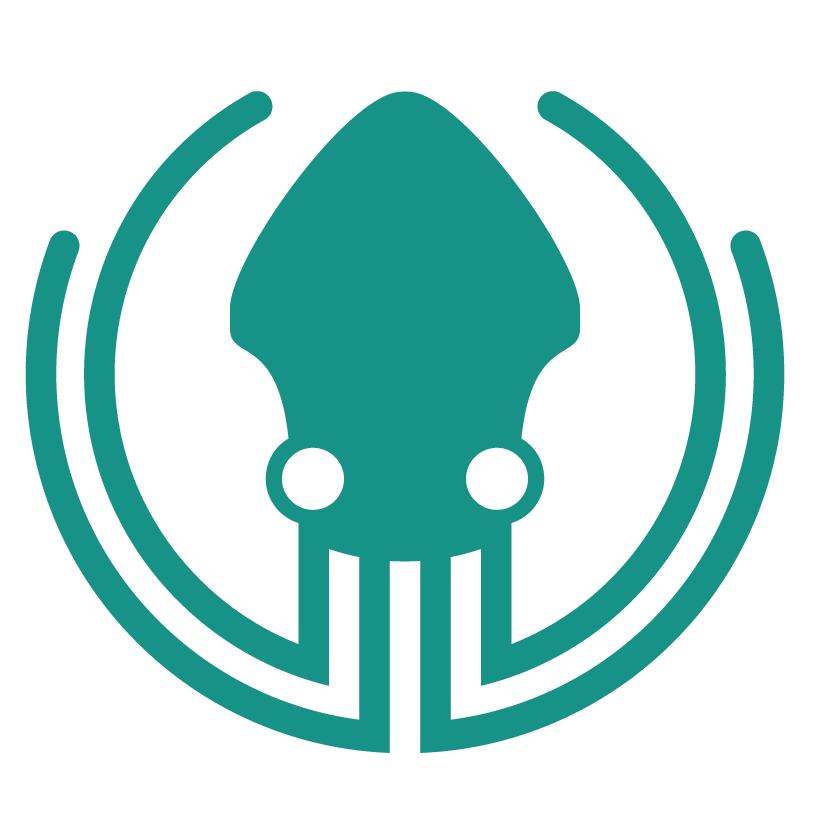

<h1 align="center">Heyyy💚</h1>

Im <b><i>Hyper</i></b> - a 17 year old game developer, gamer and weeb
 
I also have a website with some links and a portfolio at https://hypergamesdev.github.io

  

### Currently working on

### 🌟 Favorite Technologies
  *  
  *  

### 📖 What I'm currently learning
  * 

### 📚 What I want to learn
  * 

<h2 align="center">Know and using</h2>

  
  
  
  

  

  
  
  
        
  

<h2 align="center">Stats</h2>

  

  

  

<!--
**HyperGamesDev/HyperGamesDev** is a ✨ _special_ ✨ repository because its `README.md` (this file) appears on your GitHub profile.

Here are some ideas to get you started:

- 🔭 I’m currently working on ...
- 🌱 I’m currently learning ...
- 👯 I’m looking to collaborate on ...
- 🤔 I’m looking for help with ...
- 💬 Ask me about ...
- 📫 How to reach me: ...
- 😄 Pronouns: ...
- ⚡ Fun fact: ...
-->
